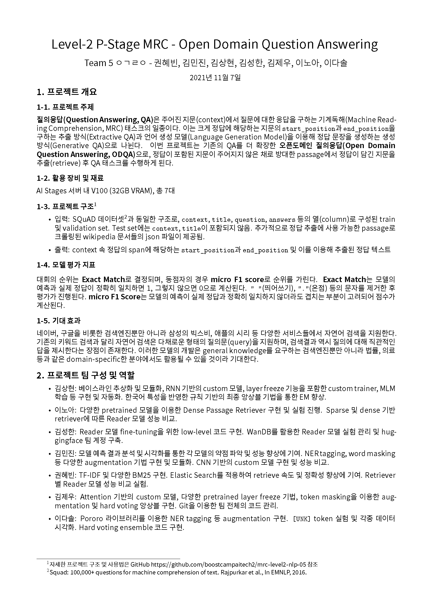
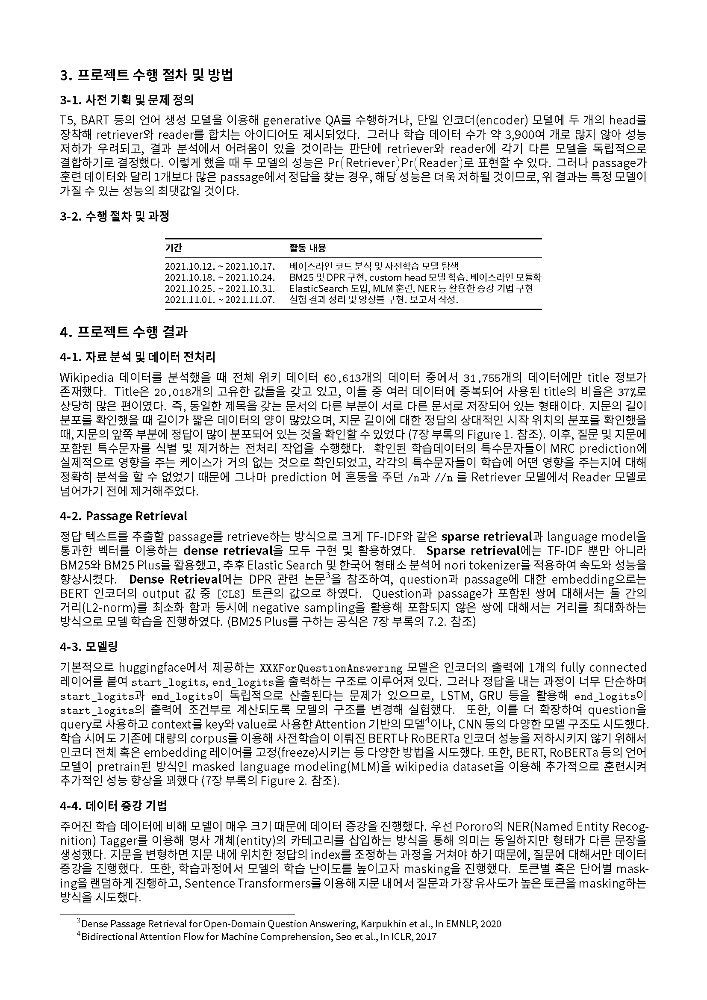
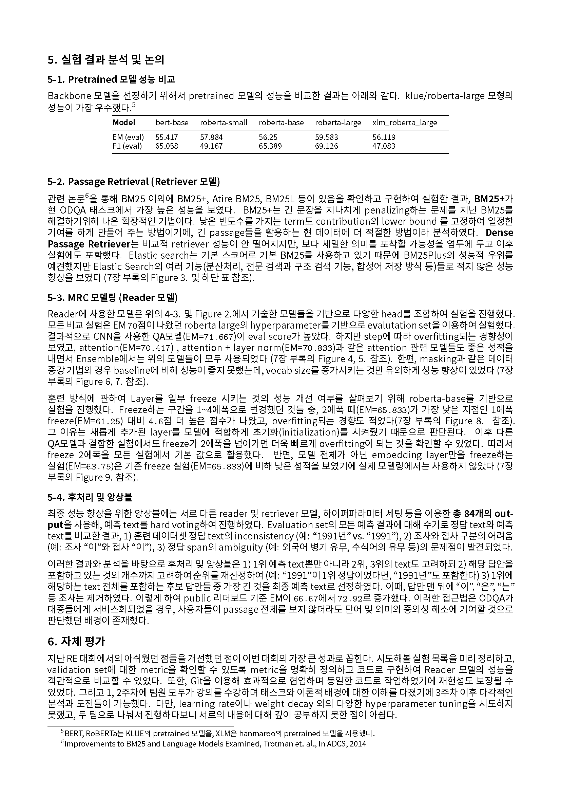
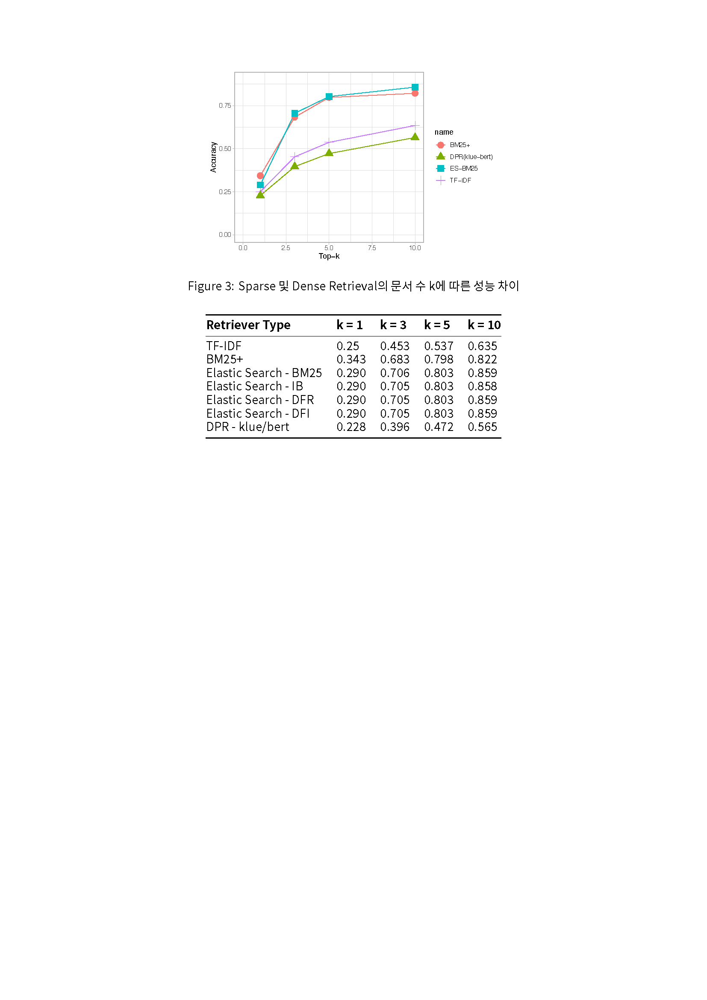
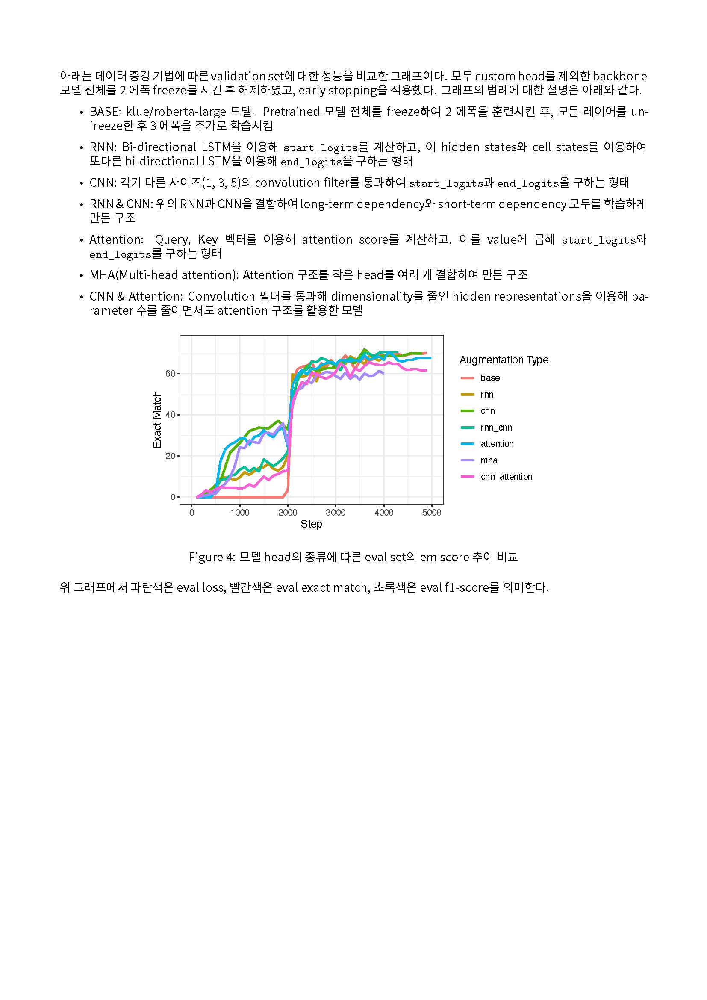
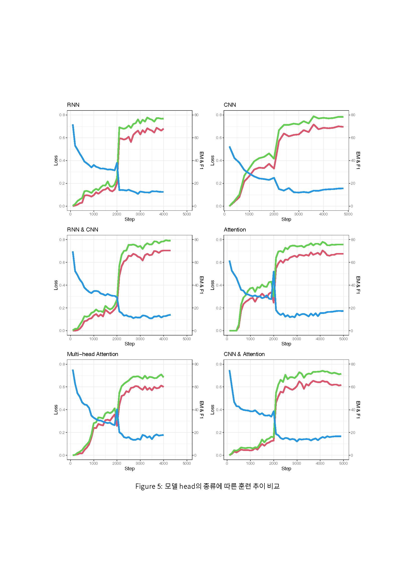
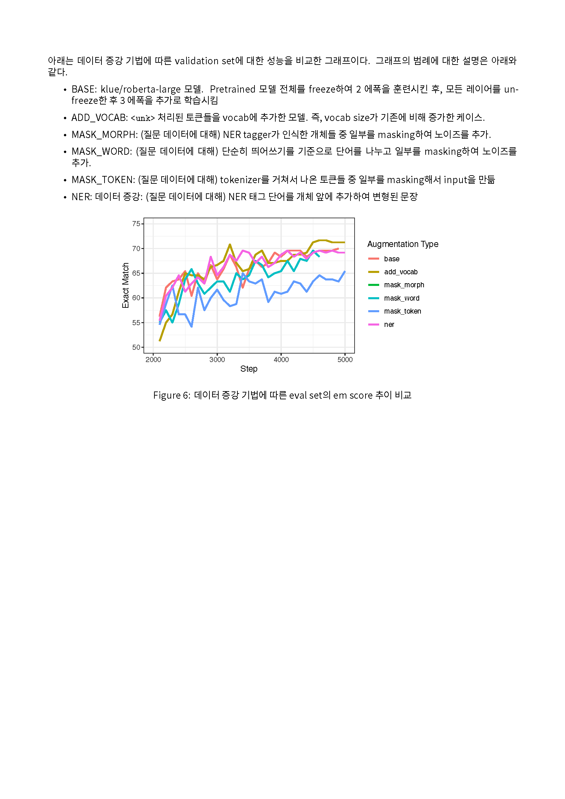
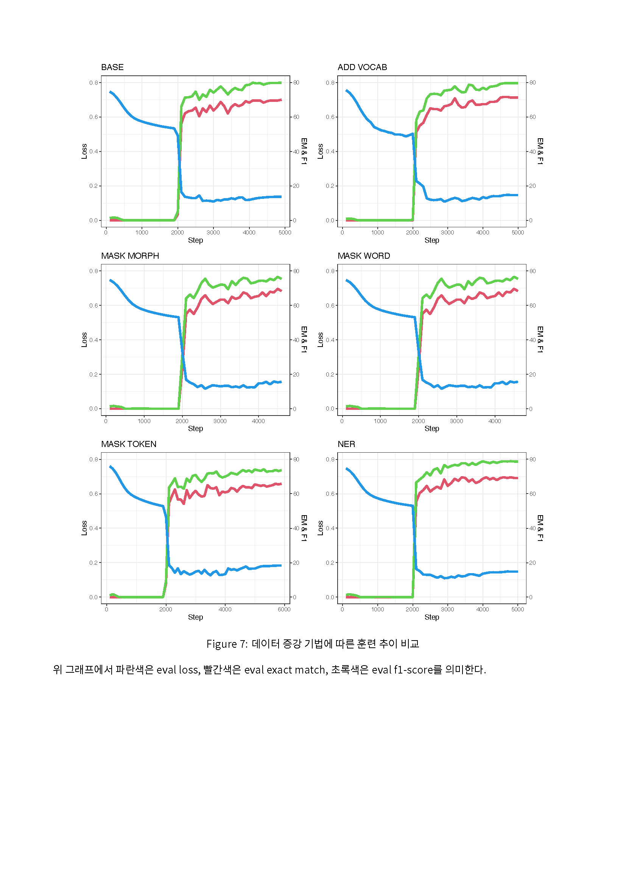
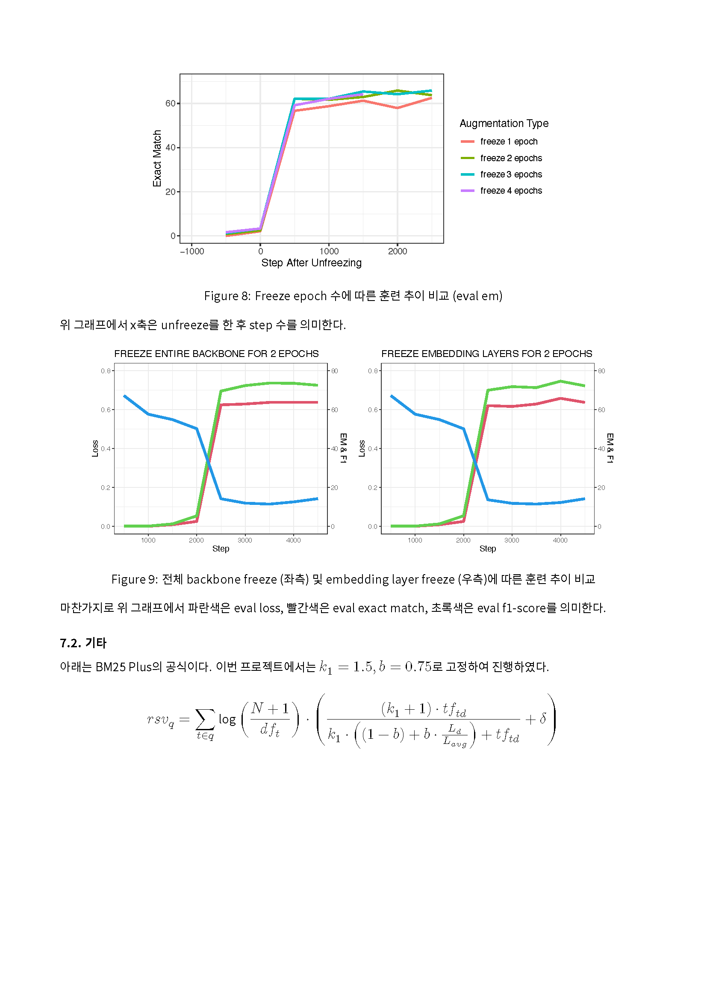

# ODQA MRC - ㅇㄱㄹㅇ

리포트는 [하단](#Report)에 있습니다.

## ODQA: Open-Domain Question Answering

ODQA는 다양한 종류의 질문에 대해 대답하는 인공지능 연구 분야인 QA(Question Answering)에 더해 주어지는 지문이 따로 존재하지 않고 사전에 구축되어 있는 Knowledge resource에서 질문에 대답할 수 있는 문서를 찾는 과정이 추가된 시스템입니다.

<br>

## How to Train

### Retriever (for Dense Retriever)
`script/train_dpr_example`를 통해 `train_dpr.py`를 실행하여 Dense Passage Retriever 를 학습시킬 수 있습니다.
```bash
python train_dpr.py \
--run_name "exp1_dpr_klue-bert" \                           
--description "klue/bert-base_dpr" \                      
--dpr_model 'klue/bert-base' \                              
--dpr_learning_rate 3e-5 \
--dpr_epochs 10 \
--dpr_warmup_steps 500 \
--wandb_project 'dpr'
```
<details>

- `train_dpr.py`는 DPR을 학습하기 위해서 customized trainer 구현하여 사용했습니다.
- 추가적으로 weight decay, train/eval batch size, eval_steps를 arguments 로 수정할 수 있습니다.
- 학습 시에 `./models/retriever` 에 `p_encoder` 및 `q_encoder` 폴더를 생성 후에 모델을 저장합니다.

</details>

<br>

### Train MRC with low-level

`script/train_mrc_example.sh` 를 통해 `train_mrc.py`를 실행하여 MRC 모델을 학습 시킬 수 있습니다.

```bash
python train_mrc.py \
--run_name exp011_klue_roberta_large_lstm_lm_concat_y \
--description "klue_roberta_large, lstm with layernorm custom head, concat_y" \
--output_dir ./saved \
--model klue/roberta-large \
--num_train_epochs 5 \
--use_max_padding \
--do_eval \
--warmup_steps 100 \
--eval_steps 100 \
--save_total_limit 7 \
--wandb_project mrc-ensemble \
--freeze_pretrained_weight first \
--freeze_pretrained_weight_epoch 2 \
--head CustomRobertaForQuestionAnsweringWithLSTMLNHead\               
--head_dropout_ratio 0.7 \
--test_eval_dataset_path test_validation_dataset --concat_eval True \
```

<details>

- `train_mrc.py` MRC 모델을 학습시킬 수 있는 huggingface의 `trainer`를 사용하지 않는 low-level 코드를 구현했습니다.
- 추가적으로 weight decay, learning rate scheduler, pre-trained weight freeze와 같은 기능들을 argument들을 통해 적용할 수 있습니다.
- 학습 시 eval loss가 이전 eval step보다 감소하거나 eval loss가 감소하지 않았지만 Exact Match 점수가 상승한 경우 저장될 수 있도록 로직을 구현했습니다.

</details>

<br>

### Train MRC v2.0

`script/train_mrc_v2_example.sh` 를 통해 `train_mrc_v2.py`를 실행하여 MRC 모델을 학습 시킬 수 있습니다.

```bash
python train_mrc_v2.py \
--run_name roberta_large_freeze_backbone \                 
--description exp_on_freeze_backbone                     
--do_train --do_eval \
--output_dir ./saved --logging_dir ./logs --seed 42 \
--model klue/roberta-large \                               
--num_train_epochs 7 \
--learning_rate 3.4e-5 --weight_decay 0.015 \
--max_seq_len 512 --max_ans_len 30 \
--evaluation_strategy steps \
--eval_steps 100 --logging_steps 100 --save_steps 200 \
--save_total_limit 5 \
--freeze_type roberta --freeze_epoch 1.0 \                  
--label_smoothing_factor 0.02 \
--wandb_project exp_trainer --wandb_entity this-is-real \
```

<br>

## How to Inference

`script/inference_example.sh` 를 실행하여 inference를 수행할 수 있습니다.

```bash
python inference.py \
--output_dir ./outputs/klue_bert_base \                     
--dataset_path ../data/test_dataset/ \                     
--model ./models/exp011_klue_roberta_large_lstm_lm_concat_y \  
--top_k_retrieval 1 \                                     
-- retriever_type 'SparseRetrieval_BM25P'                 
--do_predict
```


<details>

- Fine-tuned 된 MRC 모델을 불러와서 `retriever_type` 을 설정하여 prediction 을 뽑아주는 역할을 수행할 수 있습니다.
- `retriever_type`으로는 `SparseRetrieval_BM25P`, `SparseRetrieval_TFIDF`, `DenseRetrieval`, `get_retrieved_df` 가 있습니다.
- `DenseRetrieval` 는 사전학습된 DPR 이 존재해야하기에 `train_dpr.py` 을 실행해준 뒤에 사용이 가능해집니다.
- `get_retrieved_df` 는 retrieval 을 동시에 수행하지 않고 미리 retrieved 된 passage 가 담긴 `.csv` 파일이 존재할 시에 예외적으로 기능하게 추가해주었고, 협업의 편의상 `Elastic Search` 기반의 retrieval 방식은 서버에서 사전에 retrieve 한 뒤에 `.csv` 파일을 활용하였습니다.

</details>


<br>

## Further Explanation
<details>
## Updates
(02:57 AM, Nov 1, 2021)

* 훈련은 `train_mrc_v2.py` 파일을 통해 가능합니다. `train_mrc_trainer.py` 파일은 deprecate 되어 월요일 오후 중 삭제될 예정입니다.

* HugggingFace에서도 logger를 제공하는데, 이게 기존 Python logger와 충돌하는 것으로 보입니다. 이를 HuggingFace의 logger만을 사용하도록 수정했습니다. 

* Freeze, Unfreeze 기능이 구현되어 있습니다. 자세한 내용은 `trainer_qa.py` 파일에서 `FreezeEmbeddingCallback` 클래스와 `FreezeBackboneCallback` 클래스를 참고하면 됩니다. 

* `train_mrc_v2.py`에는 callback으로 `FreezeEmbeddingCallback`이 불러와져 있습니다. 이를 `FreezeBackboneCallback`으로 바꾸고, `backbone_name` 인자에 `"roberta"`를 넣어주면 정해진 `freeze_epochs` 동안 backbone 모델 전체를 freeze합니다. 이를 argparser로 받는 부분은 당장 중요하진 않아서, 추후 구현할 예정입니다.

* wandb를 위해 os의 environment variable을 바꾸는 게 아니라, `wandb.init()`을 통해 해결하도록 변경했습니다. 

## 베이스라인의 구조

베이스라인이 달라진 점은 크게 `QAProcessor`와 `QATrainer`가 추가된 것입니다. 기존의 베이스라인을 다양한 방식으로 변경하는 것을 시도하였으나, 호환성의 문제와 이미 베이스라인에 익숙하신 분들이 많을 것 같아서 최대한 기존 틀을 유지했습니다. 더 단순하고 직관적인 코드가 가능할 수도 있었을 "뻔"했지만 쉽지 않았던 점, 그리고 개선된 베이스라인 제공이 늦어진 점 죄송하게 생각합니다. 그러나 HuggingFace `Trainer`, `Dataset` 등을 이용해 무언가를 구현하고 싶다면 물어보시면 최대한 도움되도록 하겠습니다!

## 용어 정리

아래 내용은 HuggingFace에서 사용하고 있는 용어를 정리한 것이며, 제 코드 역시도 아래의 명명을 따릅니다. 애매모호함을 개선하기 위하고, 동일한 수준의 이해를 위해 사실상 필수적이라고 할 수 있습니다. 해당 부분이 명확하지 않아서, 1주일은 어려움을 겪었습니다.

* examples: 토큰화되기 전의 raw text 데이터를 의미합니다. 

    * 따라서 아직 context와 question을 `str` 형태로 데이터를 갖고 있으며, 토큰화를 진행해야 합니다.

    * 모델에 직접 투입될 수 없습니다.

* features: tokenizer를 거쳐 토큰화된 후의 데이터를 의미합니다. 

    * Python list, numpy ndarray, PyTorch tensor 등의 형태를 가질 수 있습니다. 
    
    * 자료 형태는 사실 크게 문제가 없는 이유가, `Trainer`에서 model의 input으로 넣을 때 자동으로 `collate` 함수를 적용하고 PyTorch tensor로 변환시킵니다. 
    
    * 다만, 이번 베이스라인 코드에서는 dataset과 혼용되어 사용됩니다. 그 이유는 model에 투입되는 사실상의 입력값이기 때문입니다.

* dataset: HuggingFace `Dataset` 클래스의 오브젝트 인스턴스를 의미합니다. 

    * pandas와 유사하게 메모리 공간상 연속된 배열의 형태로 자리하고 있어 효율적이고 빠릅니다.

    * 기본적으로 tabular 형태의 자료이기 때문에 모든 열의 길이가 동일해야 합니다.

    * dataset의 메서드들을 확인해보시면 pandas, json 등으로 손쉽게 변환할 수 있고, 혹은 그로부터 불러올 수도 있습니다.

* datasets: HuggingFace `DatasetDict` 클래스의 오브젝트 인스턴스를 의미합니다. Python의 `Dict[str, Dataset]`과 유사한 구조를 가집니다. 즉, key 값을 통해 dataset을 접근 가능합니다.

* gold_answer: 참값을 의미합니다. HuggingFace에서는 이렇게 부르더라고요.

* 단수/복수: example은 examples의 특정 하나의 행을 의미하고, 마찬가지로 feature는 features의 특정 하나의 행을 의미합니다. 이는 나중에 augmentation 구현에 중요하니 알아두셔야 합니다.

# `QAProcessor`

데이터 불러오는 함수부터 후처리까지 합쳐져 있는 형태입니다. 기존 베이스라인의 `Preprocessor`와 `postprocessor`가 합쳐진 형태입니다. 사실상 추가적으로 건드릴 필요가 없고, 추가적인 데이터 처리 기능만을 구현해주시면 됩니다. 

## 동작 순서

```python
# 1. DatasetArguments & Tokenizer
dataset_args = DatasetArguments(...) # 사실상 argparse가 수행합니다.
model = AutoModelForQuestionAnswering.from_pretrained(MODEL_NAME)
tokenizer = AutoTokenizer.from_pretrained(MODEL_NAME) # 토크나이저는 당연히 tokenize 시에 필요합니다.

# 2. Initialization
qa_processor = QAProcessor(dataset_args, tokenizer, concat=False)
# concat=True로 설정하면 train과 eval dataset을 합쳐 훈련시킵니다.
# 최종 모델 제출에 써먹을 수 있을 것 같습니다.

# 3. Get examples
train_examples = qa_processor.get_train_examples()
eval_examples  = qa_processor.get_eval_examples()

# 4. Get features
train_features = qa_processor.get_train_features()
eval_features  = qa_processor.get_eval_features()

# 5. TrainingArguments & Trainer
training_args = TrainingArguments(...)
# please set do_train=True and do_eval=True
trainer = QATrainer(
    model=model,
    args=training_args,
    train_dataset=train_features,
    eval_dataset=eval_features,
    eval_examples=eval_examples,
    post_process_function=qa_processor.post_processing_function,
    compute_metrics=compute_metrics,
)

# 6. Train!
trainer.train()
```

저게 끝입니다 여러분!!! 그러나 더 간단해지는 방법은...

```python
from transformers import AutoConfig, AutoModelForQuestionAnswering, AutoTokenizer, TrainingArguments

from datasets import load_metric

from arguments import DatasetArguments
from trainer_qa import QATrainer
from processor import QAProcessor

dataset_args = DatasetArguments(...) 
training_args = TrainingArguments(...)

config = AutoConfig.from_pretrained(MODEL_NAME)
model = AutoModelForQuestionAnswering.from_pretrained(MODEL_NAME)
tokenizer = AutoTokenizer.from_pretrained(MODEL_NAME) 

qa_processor = QAProcessor(dataset_args, tokenizer, concat=False)

metric = load_metric("squad")

def compute_metrics(pred: EvalPrediction):
    return metric.compute(predictions=pred.predictions, references=pred.label_ids)

training_args = TrainingArguments(...)
trainer = QATrainer(
    model=model,
    args=training_args,
    train_dataset=qa_processor.get_train_features(),
    eval_dataset=qa_processor.get_eval_features(),
    eval_examples=qa_processor.get_eval_examples(),
    post_process_function=qa_processor.post_processing_function,
    compute_metrics=compute_metrics,
)
```

## `QAProcessor.__init__(dataset_args, tokenizer, concat)`

* `dataset_args.data_dir`의 `datasets`를 불러와 train, eval, test `dataset`을 만듭니다. 즉, `inference.py`에서도 활용이 가능합니다.

* `tokenizer` 등을 클래스 내 인스턴스 변수로 할당하여, 전처리 및 후처리에 활용가능하도록 합니다.

* `concat=True`로 설정하면 train과 eval을 합쳐 train dataset을 만듭니다.

## `QAProcessor.get_train_examples()`

* `Dataset` 클래스의 train examples를 반환합니다.

* 마찬가지로 `get_eval_examples()`, `get_test_examples()`도 동일합니다.

## `QAProcessor.get_train_features()`

* `Dataset` 클래스의 train features를 반환합니다.

* 기존에 loss가 계산되지 않은 이유는 QA의 label에 해당하는 `start_positions`과 `end_positions`를 반환하지 않았기 때문입니다. 이를 반환하도록 개선하였습니다.

## 앞으로의 TODO

* `inference.py` 수정

* `RandomFlip` 구현: 한국어는 어순에 관계없이 문장의 의미가 크게 달라지지 않을 것이라는 가정

* `MultipleAnswers` 구현: gold_answer에 해당하는 모든 span을 찾아 `answers`에 추가하는 것입니다. 일단 답만 맞으면 되기 때문에, 얼마나 성능을 늘릴 지는 고민해볼 법합니다.

</details>


# Report




















